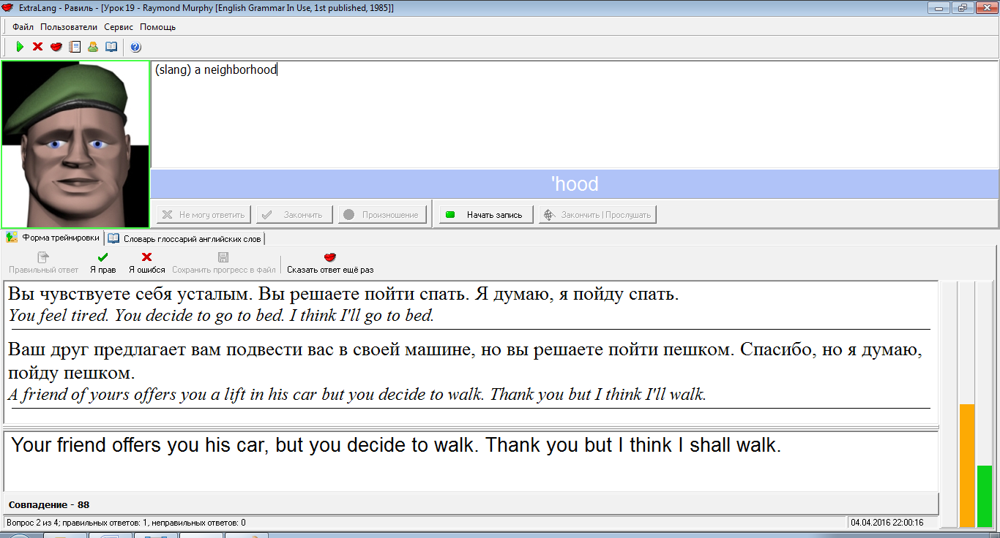
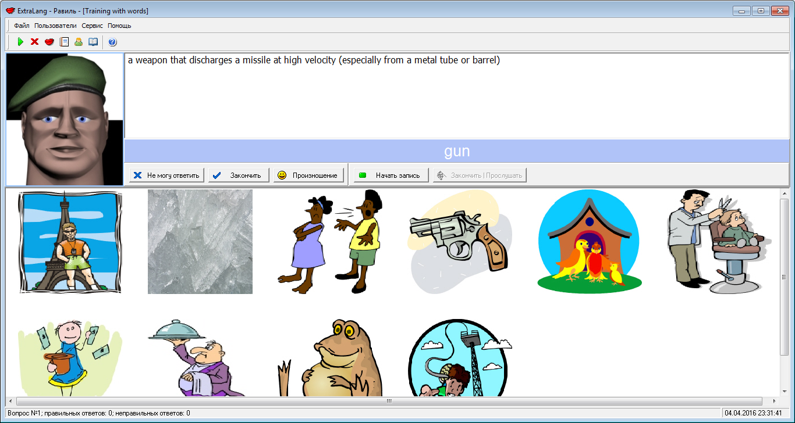
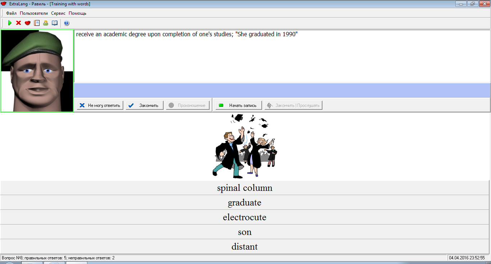
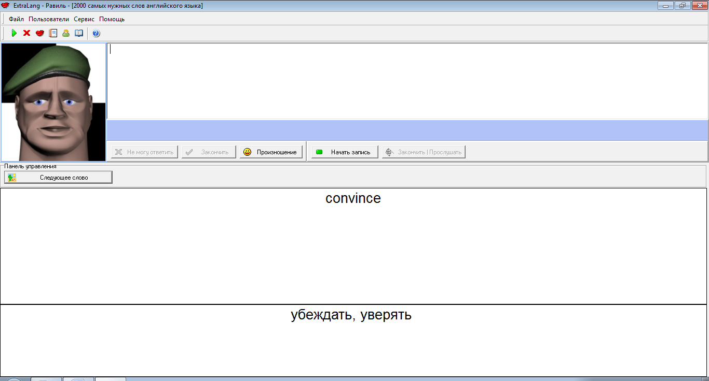

# ExtraLang
This program helps a user to learn languages by engaging in simple games. The WordNet 3 database is used for English words. The program was originally developed for Russian-speaking people, but it can be adapted to any languages as long as the appropriate databases are provided. A text-to-speech engine is used to pronounce English words.

  
*Fig. 1: Training mode selection window*

  
*Fig. 2: Russian-English translation mode*

  
*Fig. 3: Selection of the image by its description*

  
*Fig. 4: Selection of a word by its image and description*

  
*Fig. 5: Viewing of the top 2000 most used English words*
