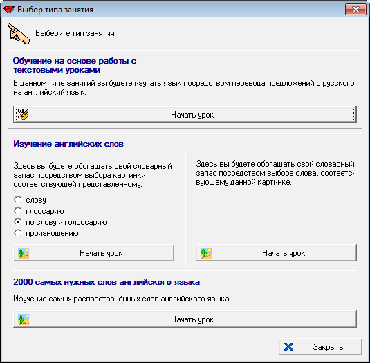

# ExtraLang
This program helps a user to learn languages by engaging in simple games. The program makes use of the WordNet database, and was originally developed for Russian-speaking people, but it can be adapted to any languages as long as the appropriate databases are provided.

  

*Fig. 1: Training mode selection window*

  

*Fig. 2: Russian-English translation mode*

  

*Fig. 3: Selection of the image by its description*

  

*Fig. 4: Selection of a word by its image and description*

  

*Fig. 5: Viewing of the top 2000 most used English words*

